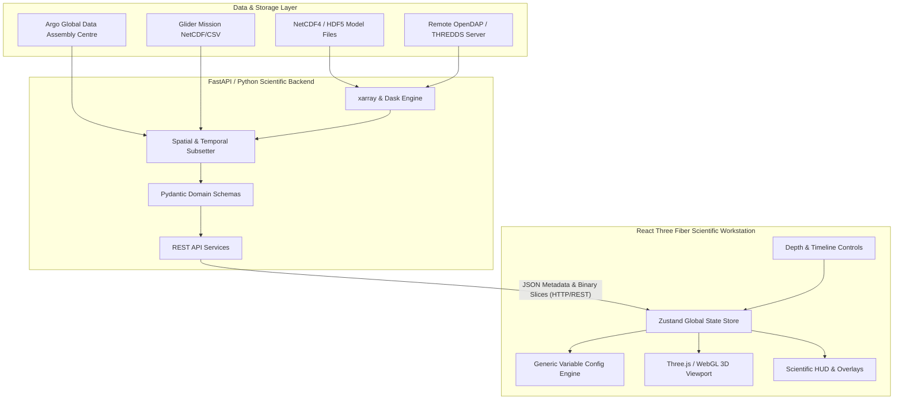

# Architecture Specification - 3D Ocean Data Visualization Platform

## 1. System Overview

The 3D Ocean Data Visualization Platform is a scientific workstation designed for high-resolution, multi-dimensional oceanographic simulation and observational analysis, inspired by the INCOIS (Indian National Centre for Ocean Information Services) problem statement for Smart India Hackathon (SIH) 2026.

The platform visualizes:
- **4D Ocean Model Simulation Fields**: Time, Depth, Latitude, Longitude grids produced by hydrodynamic models (e.g., ROMS, NEMO).
- **Physical & Biogeochemical Variables**: Temperature, Salinity, Chlorophyll-a, and 3D current velocities ($u, v, w$).
- **In-situ Marine Observation Networks**: Argo profiling floats, autonomous underwater gliders, and moored buoys.
- **Interactive Multi-strata Slicing & Visual Analytics**: Depth slice planes, isosurfaces, current vector flowlines, and metadata-driven color scales.



---

## 2. Monorepo Organization

```text
ocean-model/
├── backend/                  # Python 3.11+ scientific backend
│   ├── app/
│   │   ├── api/              # FastAPI route controllers (/health, /dataset)
│   │   ├── core/             # Configuration & environment settings
│   │   ├── schemas/          # Pydantic domain models (CF-compliant)
│   │   ├── services/         # Dataset & metadata orchestration services
│   │   ├── generators/       # Synthetic multi-dimensional tensor generators
│   │   ├── parsers/          # NetCDF / GRIB2 / CSV file readers
│   │   ├── adapters/         # Argo / Glider in-situ platform adapters
│   │   ├── tests/            # Pytest test suite (health, schemas, dataset)
│   │   └── main.py           # FastAPI entrypoint & middleware configuration
│   ├── requirements.txt      # Python dependencies (fastapi, xarray, numpy, pytest)
│   └── pytest.ini            # Pytest runner configuration
│
├── frontend/                 # React + TypeScript + Vite frontend
│   ├── src/
│   │   ├── components/
│   │   │   ├── layout/       # Header, LeftControlPanel, RightInfoPanel, BottomTimeline
│   │   │   ├── controls/     # VariableSelector, DepthSlider, LayerToggles, ColorScaleControl
│   │   │   └── visualization/# OceanViewport, OceanVolumePlaceholder, CoordinateGrid, ViewportHUD
│   │   ├── features/
│   │   │   ├── ocean/        # Variable registry & resolution engine
│   │   │   └── observations/ # In-situ platform markers & color definitions
│   │   ├── hooks/            # useDataset hook for metadata & health polling
│   │   ├── services/         # API HTTP client layer
│   │   ├── store/            # Zustand global application state store
│   │   ├── types/            # TypeScript interfaces mirroring API and domain types
│   │   ├── utils/            # Scientific color palettes & scaling transforms
│   │   ├── App.tsx           # Dashboard composition root
│   │   └── index.css         # Deep ocean dark theme design system
│   ├── index.html            # Web entry point with scientific typography
│   ├── package.json          # Node dependencies (Three.js, R3F, Zustand, Lucide)
│   └── vite.config.ts        # Vite build tool & backend proxy configuration
│
├── data/                     # Data directory
│   ├── sample_metadata.json  # Static reference export of canonical dataset metadata
│   └── README.md             # Data access instructions
│
└── docs/                     # Architectural documentation
    ├── architecture.md       # Client-server & rendering architecture
    └── data-model.md         # Canonical 4D ocean domain model
```

---

## 3. Backend Architecture

### 3.1 FastAPI & Clean REST Architecture
The backend is built using **FastAPI** with strict **Pydantic v2** validation. Endpoints return structured, strongly validated responses conforming to Climate and Forecast (CF-1.8) and Attribute Convention for Data Discovery (ACDD-1.3) standards.

### 3.2 Endpoints in Phase 1
- `GET /api/health`: Health status endpoint returning `{"status": "ok", "version": "0.1.0", "service": "ocean-data-backend"}`.
- `GET /api/dataset`: Canonical dataset metadata endpoint returning 4D coordinate dimensions, variable catalog, spatial/temporal bounds, and in-situ observation platforms.

### 3.3 How Synthetic Data Evolves to Real NetCDF / xarray
In Phase 1, metadata is generated through `DatasetService.get_canonical_dataset()` without requiring massive binary files.

In subsequent phases:
1. **NetCDF Loader**: `xarray.open_dataset('model_output.nc', chunks={'time': 1, 'depth': 1})` loads actual ROMS/INCOIS NetCDF files lazily using Dask.
2. **Binary Tensor Streaming**: Slices along `[time_idx, depth_idx, :, :]` will be serialized as compact binary arrays (e.g., float32 ArrayBuffers or compressed Zarr chunks) directly consumable by WebGL textures in the frontend.
3. **OpenDAP Integration**: Remote servers such as INCOIS THREDDS or ERDDAP can be queried dynamically via URL without downloading full multi-gigabyte models locally.

---

## 4. Frontend Architecture

### 4.1 React Three Fiber & WebGL Pipeline
The 3D visualization is rendered using **Three.js** via **React Three Fiber (R3F)** and **@react-three/drei**:
- **Camera & Navigation**: `PerspectiveCamera` coupled with `OrbitControls` (damping factor 0.08, constrained pitch and distance limits).
- **Coordinate Framework**: Bounding grid box with longitude, latitude, and depth axes with real-time vertical exaggeration scaling.
- **Ocean Plane & Dynamic Slicer**: A sea-surface mesh with ambient water illumination, paired with a dynamic horizontal depth slice plane translated along the vertical $Y$-axis based on `selectedDepth`.
- **In-situ Marker Visualization**: 3D float geometries for Argo platforms with dashed profiling lines down to cast limits, plus trajectory cones for autonomous gliders.

### 4.2 Generic Variable Configuration Engine
**Architectural Rule**: The client never assumes temperature is the only variable.
The `resolveVariableConfig(variableId, metadata)` engine inspects incoming metadata (standard name, units, valid min/max, default palette, scale type) and provides visualization parameters dynamically.

### 4.3 State Management (Zustand)
`oceanStore.ts` centralizes:
- Active coordinates: `selectedVariable`, `selectedTimeIndex`, `selectedDepth`.
- Color mapping: `colorScale`, `colorMin`, `colorMax`, `scaleType` (`'linear' | 'log'`).
- Display toggles: `showOceanVolume`, `showCurrents`, `showArgo`, `showGliders`, `showGrid`, `showBathymetry`.
- Temporal playback: `isPlaying`, `playbackSpeedMs`, `stepTime()`.
- Active observation platform selection.

---

## 5. In-situ Observation Representation
Observational data from autonomous platforms are treated as first-class domain entities:
- **Argo Floats**: Identified by WMO ID, tracking position ($lat, lon$), continuous vertical CTD casts (0 to 2000m), and measured properties (temperature, salinity).
- **Underwater Gliders**: Sawtooth trajectory waypoints through intermediate strata (0 to 1000m).
- **Comparison Flow**: Future phases will project observational cast points directly onto the colormapped 3D model field to compute model-vs-observation residual anomalies ($X_{\text{obs}} - X_{\text{model}}$).
