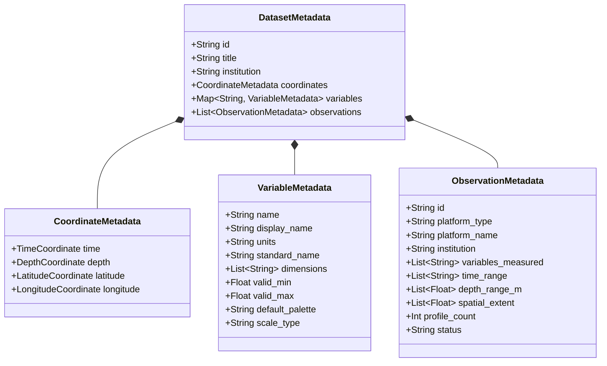

# Canonical Ocean Data Model Specification

## 1. Domain Dimensions

The platform organizes physical ocean data along four canonical dimensions:

$$\text{Field} = \text{Variable}[\text{time}][\text{depth}][\text{latitude}][\text{longitude}]$$

| Dimension | Standard Identifier | Dimension Order | Units | Convention | Description |
| :--- | :--- | :--- | :--- | :--- | :--- |
| **Time** | `time` | 0 (Outer) | ISO-8601 UTC | Gregorian Calendar | Forecast/hindcast timestamps |
| **Depth** | `depth` | 1 | `meters` | Positive Down ($0.0 = \text{surface}$) | Ocean vertical stratification |
| **Latitude** | `latitude` | 2 | `degrees_north` | WGS 84 ($-90.0^\circ$ to $+90.0^\circ$) | North-South coordinate |
| **Longitude** | `longitude` | 3 (Inner) | `degrees_east` | WGS 84 ($0.0^\circ$ to $360.0^\circ$ or $-180^\circ$ to $+180^\circ$) | East-West coordinate |

---

## 2. Canonical Model Variables

The initial prototype supports six core ocean variables with CF-compliant metadata:

| Variable Identifier | Display Title | CF Standard Name | Units | Typical Range | Default Colormap | Scale Type |
| :--- | :--- | :--- | :--- | :--- | :--- | :--- |
| `temperature` | Sea Water Temperature | `sea_water_temperature` | `degC` | $2.0^\circ\text{C}$ to $32.0^\circ\text{C}$ | `thermal` | Linear |
| `salinity` | Sea Water Salinity | `sea_water_salinity` | `PSU` | $32.0$ to $37.5\text{ PSU}$ | `haline` | Linear |
| `chlorophyll` | Chlorophyll-a Concentration | `mass_concentration_of_chlorophyll_a_in_sea_water` | $\text{mg/m}^3$ | $0.01$ to $15.0\text{ mg/m}^3$ | `algae` | Logarithmic |
| `u_current` | Zonal Current (U - Eastward) | `eastward_sea_water_velocity` | $\text{m/s}$ | $-2.5$ to $+2.5\text{ m/s}$ | `coolwarm` | Linear |
| `v_current` | Meridional Current (V - Northward) | `northward_sea_water_velocity` | $\text{m/s}$ | $-2.5$ to $+2.5\text{ m/s}$ | `coolwarm` | Linear |
| `w_current` | Vertical Velocity (W - Upward) | `upward_sea_water_velocity` | $\text{m/s}$ | $-0.05$ to $+0.05\text{ m/s}$ | `coolwarm` | Linear |

### Derived Variables
- **Horizontal Current Speed**: Calculated as $\sqrt{u^2 + v^2}$, units in $\text{m/s}$, mapped to `speed` palette.
- **Density Anomaly ($\sigma_t$)**: Computed from $(T, S, P)$ via TEOS-10 / UNESCO equation of state.

---

## 3. Metadata Separation Principle

In this architecture, **metadata is strictly separated from numerical values**:
1. **Metadata Payload** (`DatasetMetadata`): Lightweight JSON containing coordinate bounds, variable definitions, and observation summaries. Transferred on application initialization.
2. **Data Payload** (Future Phase): Binary slices (Float32 ArrayBuffers) or WebGL textures transferred on demand when coordinates (`time_index`, `depth_level`) or variables change.

### Example Variable Metadata JSON
```json
{
  "name": "temperature",
  "display_name": "Sea Water Temperature",
  "units": "degC",
  "standard_name": "sea_water_temperature",
  "dimensions": ["time", "depth", "latitude", "longitude"],
  "description": "Synthetic demonstration sea-water potential temperature field across the Indian Ocean basin",
  "valid_min": 2.0,
  "valid_max": 32.0,
  "default_palette": "thermal",
  "scale_type": "linear",
  "fill_value": -9999.0
}
```

---

## 4. In-situ Observation Domain Model

In-situ ocean observations differ from regular model grids because they represent discrete trajectories, profiles, or time-series points:



### Supported Platform Types
- **`argo`**: Autonomous profiling CTD floats drifting at 1000m parking depth and profiling from 2000m to the surface every 10 days.
- **`glider`**: Autonomous underwater gliders traversing sawtooth profiles across oceanic fronts and boundary currents.
- **`mooring`**: Fixed oceanographic buoys (e.g., INCOIS OMNI buoy network) recording high-frequency surface meteorological and subsurface thermistor chain data.

---

## 5. Procedural Synthetic Ocean Generator Formulation

### 5.1 Coordinate Discretization
- **Time** ($N_t = 10$): $6$-hour step interval over $2.25$ days ($2026\text{-}09\text{-}01\text{T}00:00\text{Z}$ to $2026\text{-}09\text{-}03\text{T}06:00\text{Z}$).
- **Depth** ($N_z = 24$): Non-uniform levels $[0, 5, 10, 20, 30, 40, 50, 60, 75, 100, 125, 150, 175, 200, 250, 300, 400, 500, 600, 700, 800, 900, 950, 1000]\text{ m}$.
- **Latitude** ($N_y = 64$): Uniform grid from $0.0^\circ\text{N}$ to $30.0^\circ\text{N}$ ($\Delta \phi \approx 0.476^\circ$).
- **Longitude** ($N_x = 96$): Uniform grid from $55.0^\circ\text{E}$ to $100.0^\circ\text{E}$ ($\Delta \lambda \approx 0.474^\circ$).

### 5.2 Mathematical Formulations

#### 1. Temperature Model
$$T(t, z, y, x) = T_{\text{deep}} + (T_{\text{surf}}(y, x, t) - T_{\text{deep}}) \cdot \frac{1}{1 + \exp\left(\frac{z - z_{\text{th}}}{d_{\text{th}}}\right)} + \Delta T_{\text{warm}}(t, z, y, x) + \Delta T_{\text{cold}}(t, z, y, x) + \epsilon_T$$
- **Warm Anticyclonic Eddy**: Gaussian anomaly centered at $(x_w(t), y_w(t))$ drifting westward, $\Delta T > 0$, depressing the thermocline.
- **Cold Cyclonic Eddy**: Gaussian anomaly centered at $(x_c(t), y_c(t))$ drifting southwest, $\Delta T < 0$, shoaling the thermocline and driving upwelling.

#### 2. Salinity Model
$$S(t, z, y, x) = S_{\text{base}} + \Delta S_{\text{regional}}(x) + S_{\text{subsurf\_max}}(z, x) + S_{\text{fresh\_lens}}(z, x) + \Delta S_{\text{eddy}} + \epsilon_S$$
- High-salinity Arabian Sea ($>36.5\text{ PSU}$) with subsurface salinity maximum at $\approx 120\text{ m}$.
- Low-salinity Bay of Bengal ($<33.5\text{ PSU}$) with shallow freshwater riverine plume lens.

#### 3. Chlorophyll-a Model
$$C(t, z, y, x) = C_{\text{bg}} + \left[C_{\text{scm}} \exp\left(-\frac{(z - z_{\text{scm}})^2}{2\sigma^2}\right) + C_{\text{upwell}} + C_{\text{coastal}}\right] \cdot \exp\left(-\left(\frac{z}{150}\right)^3\right) + \epsilon_C$$
- Subsurface Chlorophyll Maximum (SCM) peaking at $55\text{ m}$.
- Enhanced biological productivity in the divergent upwelling zone of the cyclonic cold eddy.

#### 4. Eddy-Correlated Ocean Currents ($u, v, w$)
- Synthetic rotational flow around eddy cores with exponential depth attenuation:
  - Anticyclonic (warm) eddy: clockwise rotation ($u = +\Omega \Delta y, v = -\Omega \Delta x$), downwelling ($w < 0$).
  - Cyclonic (cold) eddy: counter-clockwise rotation ($u = -\Omega \Delta y, v = +\Omega \Delta x$), upwelling ($w > 0$).
  - $w(z)$ satisfies physical kinematic boundary conditions: $w(0) = 0$ and $w(1000) = 0$.

### 5.3 Scenario Configurations
- **`normal`**: Balanced baseline with both warm and cold mesoscale eddies.
- **`warm_eddy`**: Amplified warm anticyclonic core (+4.2°C anomaly, intensified clockwise circulation).
- **`cold_eddy`**: Amplified cold cyclonic core (-4.5°C anomaly, strong upwelling, enhanced chlorophyll bloom).
- **`strong_currents`**: Accelerated surface velocities ($>2.0\text{ m/s}$) with pronounced rotational shears.
